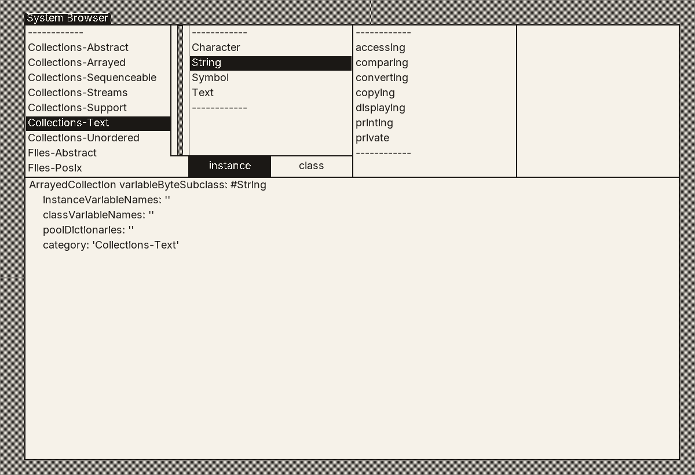

# Smalltalk-2026

A Smalltalk-80 written in C that runs Smalltalk bytecodes on **every core of the
machine at once**, and is checked byte-for-byte against Xerox's own 1983
execution traces.



Every production Smalltalk — Squeak, Pharo, Cuis, VisualWorks, GNU Smalltalk —
schedules its processes green, on one OS thread. `Process`,
`ProcessorScheduler` and `Semaphore` are real, and they buy concurrency but
never parallelism. This one replaces the object memory and the scheduler with
ones that use the whole machine, and keeps the language, the class library and
the interface.

| | |
|---|---|
| Language | C11 · no dependencies but SDL3, and that only for the window |
| Graphics | SDL3 |
| Platforms | Linux (developed on); macOS and Windows ports exist and are unverified |
| Licence | BSD 2-Clause. See [Provenance](#provenance) — parts of the tree are other people's |

## It runs on every core

Measured on 8 physical cores, one worker per core, total work fixed and divided
between them. `make OM=mt bench`:

| kernel | 1 worker | 8 workers | speedup | what it measures |
|---|---|---|---|---|
| arithmetic | 155.1 ms | 19.9 ms | **7.79×** | the interpreter's loop, nothing allocated |
| mandelbrot | 380.4 ms | 48.1 ms | **7.91×** | heavy arithmetic, almost no allocation — the ceiling |
| intervals | 124.9 ms | 27.3 ms | **4.58×** | pure interpretation: sends, blocks, a context per activation |
| collections | 191.7 ms | 29.7 ms | **6.45×** | heavy allocation and collection — the case a shared heap makes hardest |

Every worker computes something only it can check, so a fault arrives as a
wrong answer rather than as a hope that a sanitizer noticed. The whole suite is
clean under ThreadSanitizer at 31 threads, and that is a gate, not a report.

For why the numbers are what they are — including where the object table helps
and where it costs — see [`doc/SCALING.md`](doc/SCALING.md).

## It is checked against 1983

The Xerox tape carried reference dumps and execution traces beside the image.
Checking against those is far sharper than any test we could write, because
they were produced by the machine this is pretending to be:

| Oracle | Result |
|---|---|
| **`trace2`** | **611 / 611 lines, byte for byte** — every bytecode, send, return and primitive of the image's startup |
| `trace3` | 482-line prefix exact; the one documented divergence is in `tests/unit/test_trace.c` |
| `class.oops` | 446 / 446 classes — pointer, octal, hex and name |
| `method.oops` | 4,494 / 4,494 methods — pointer, class and selector |
| `ref-count-distribution` | 18,391 objects, all 124 histogram buckets |

**One interpreter, two object memories.** `src/om/om.h` defines the
object-memory operations as macros and exactly one implementation is compiled
in, so the hot path inlines either way:

- `om_bb.c` — Blue Book Chapter 30 verbatim: 16-bit object pointers, object
  table, reference counting. Never shipped. It exists so the *same interpreter*
  can load the real 1983 image and reproduce Xerox's traces.
- `om_mt.c` — 64-bit object table, tagged SmallIntegers, per-worker allocation,
  a marking collector at a safepoint, weak references and ephemerons.

Passing `trace2` therefore validates the same code the parallel system runs.
That is the central trick of the project.

## Quick start

```sh
make OM=mt              # build ./st80
make OM=mt test         # unit suites, then every profile's own SUnit suites
make help               # targets and variables
```

Bootstrap an image from source and run its desktop:

```sh
./st80 -bootstrap -manifest sources/MANIFEST -o st80.image
./st80 -run st80.image
```

Or evaluate something without a window:

```sh
$ ./st80 -bootstrap -manifest sources/MANIFEST -eval '(1 to: 10) inject: 0 into: [:a :b | a + b]'
55
```

| Variable | Meaning |
|---|---|
| `OM=mt` | 64-bit threaded object memory — the real system |
| `OM=bb` | 16-bit Blue Book memory (the default) — the validation harness |
| `TSAN=1` | ThreadSanitizer build |
| `ASAN=1` | Address + UB sanitizer build |

Sanitizer builds go to their own directory, so an instrumented binary can never
be linked against stale uninstrumented objects.

The interface has two habits worth knowing before you decide it is broken —
menus are press-and-hold, and a new window is placed by dragging out its
rectangle. [`doc/Display.md`](doc/Display.md) covers those and the display.

## What runs today

**The 1983 class library, entire.** All 4,500-odd methods of the 226 MIT
classes in `sources/` compile and bootstrap into a live image, and the Browser,
Compiler, Inspector and Debugger in it are the library's own, not ours.

**A language past the Blue Book.** Full closures with non-local return,
`ensure:`/`ifCurtailed:`, an exception system (`signal`, `on:do:`, `retry`,
`resume:`, `pass`), general pragmas, dynamic arrays `{ }`, byte arrays `#[ ]`,
block-local temporaries, and traits by load-time flattening. Bytecodes are
Squeak's V3PlusClosures, because we compile the source ourselves and so choose
the encoding. See [`doc/LanguageExtensions.md`](doc/LanguageExtensions.md).

**Pharo's own code, on Pharo's own tests.** Packages are imported in Tonel
format and held to their upstream suites, ratcheted in both directions —
a score may not fall, and may not rise without being recorded:

| Profile | Tests |
|---|---|
| `st2026` | 12 / 12 |
| `pharo-announcements` | 43 / 43 |
| `pharo-time` | 633 / 633 |
| `pharo-weak` | 32 / 32 |
| `pharo-collections` | 469 / 469 |

**1,177 of those are Pharo's own tests**, run unmodified against this system;
the other 12 are ours, for the exceptions and concurrency classes 1983 has no
equivalent of. The composed image is 264 classes and 5,123 methods. Where this is going is
[`doc/PLAN-TO-PHARO.md`](doc/PLAN-TO-PHARO.md).

**A screen that is not from 1983.** The display Form is grown to fill the
window rather than letterboxed into it, and text is Inter, proportional and
antialiased — on a system whose BitBlt is still one bit per pixel, because
BitBlt has to stay the Blue Book's. How that is possible is the interesting
part, and it is in [`doc/Display.md`](doc/Display.md).

## Design

**Why keep an object table**, when Spur and every modern VM dropped it? Under
threading the trade inverts: `become:` is one atomic swap instead of a
stop-the-world heap scan, pinning for SDL and FFI is free, and compaction
touches one entry per object rather than every reference to it. We pay one
indirection to buy atomic identity mutation.

**The semantic break.** Smalltalk-80 guarantees a process is never preempted by
another of the same priority, and the 1983 library uses that as an implicit
lock. We break it deliberately, and supply `Mutex`, `Monitor`, `SharedQueue`
and `Promise` in its place. This is normative:
[`doc/CONCURRENCY.md`](doc/CONCURRENCY.md) is required reading before writing
Smalltalk for this system.

**Thread map.** Thread 0 is a dedicated SDL pump and never executes Smalltalk;
threads 1..N are Smalltalk workers and never call SDL video. SDL3's
main-thread-only rules and macOS's Cocoa run loop force this shape.

**`sources/` is never edited.** Every divergence from 1983 is a new file in
`lib/` or `pharo/`, so "how far have we drifted" has a mechanical answer and
the Blue Book path stays untouched code rather than carefully-preserved code.

## Layout

```
src/port/       threads, mutexes, condition variables, TLS, time, atomics
src/om/         object memory (bb and mt), image readers, collector
src/interp/     bytecode interpreter, contexts, method lookup, primitives
src/gfx/        BitBlt, display, SDL3 pump, the rasterised face
src/sched/      Process, Semaphore, the scheduler
src/compiler/   Smalltalk compiler in C, chunk and Tonel readers
src/boot/       image bootstrap
sources/        the 1983 class library (MIT), vendored, frozen — 226 classes
lib/            ours: exceptions, concurrency, SUnit, protocol shims
pharo/          imported Pharo packages, each with a PROVENANCE.md
profiles/       which packages compose an image
tools/          make_font.py — rasterises an outline face into the strike
oracle/         PRIVATE, gitignored — see doc/LICENSING.md
```

## Documentation

| | |
|---|---|
| [`doc/CONCURRENCY.md`](doc/CONCURRENCY.md) | the semantic break, the primitive table, the locking rules |
| [`doc/SCALING.md`](doc/SCALING.md) | the benchmark, and what each kernel is actually measuring |
| [`doc/Display.md`](doc/Display.md) | the window, the face, antialiasing, and what the interface expects of you |
| [`doc/LanguageExtensions.md`](doc/LanguageExtensions.md) | every post-1983 syntax, and where each stands |
| [`doc/PLAN-TO-PHARO.md`](doc/PLAN-TO-PHARO.md) | where this is going, sized honestly |
| [`doc/LICENSING.md`](doc/LICENSING.md) | what may be redistributed, and what may not |

## Provenance

The tree is not all one licence, and the distinction matters:

- **Ours** — `src/`, `lib/`, `tests/`, `tools/`, `doc/`: BSD 2-Clause.
- **`sources/`** — the 1983 class library from
  [`markbush/Smalltalk-80-Sources`](https://github.com/markbush/Smalltalk-80-Sources),
  MIT. Vendored and never edited.
- **`pharo/`** — imported from [Pharo](https://github.com/pharo-project/pharo),
  MIT with parts under Apache-2.0. Every file keeps its notice and every
  package carries a `PROVENANCE.md` recording the upstream commit and any
  local edit.
- **`src/gfx/font_face.c`** — a rasterisation of Inter (SIL Open Font License
  1.1). The font itself is not vendored: `tools/make_font.py` runs against one
  installed on the machine and the *output* is what is checked in.
  `src/gfx/LICENSE.font` is the licence it derives under.
- **`oracle/`** — the Xerox image and traces. **Never committed, never
  redistributed.** They carry no licence grant from any host and are used only
  as a private development oracle. Nothing is copied from them.
